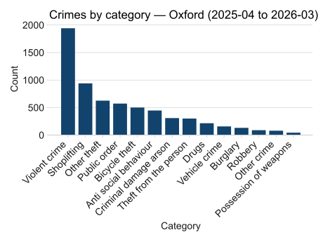

# Overview

A data pipeline which queries the UK Police API, transforms the returned JSON data, and loads it as converted CSV files into a database that can be queried. A suite of tests cover the core transformation and loading logic. Structured logging captures events at each stage. The pipeline runs automatically at 06:00 GMT on the first of each month. The pipeline collects data for an area that is within a 1-mile radius of the centre of Oxford by default, but can be configured to extract data for a user-defined area using latitude and longitude.

## Getting started

Requires Python 3.12 and pip. Clone the repository, then:

```bash
python -m venv .venv
source .venv/bin/activate
pip install -r requirements.txt
```

## Data source

- Data originates from the UK Police open data API
- Uses the [street-level crimes](https://data.police.uk/docs/method/crime-street/) endpoint
- No authentication required
- Pipeline queries the 'last-crime-updated' endpoint to ensure that most recently published data is extracted
- Default time window is the most recent 12 months' of published data. The `months` parameter in `ingest_time_window` can be used to change how far back the pipeline looks
- Default location is the centre of Oxford. Passing latitude and longitude to `fetch_crimes` enables the user to define their own location

## Usage

The pipeline runs the following steps on the first of each month via GitHub actions. Manual runs are the exception, not the rule. Each run ingests the last 12 months of street-level crime data and commits the results back to the repository.

To trigger a manual run, navigate to the Actions tab in GitHub, select the workflow, and click Run workflow.

```bash
python src/ingest.py
python src/transform.py
python src/load.py
```

## Project structure

```bash
src/ingest.py       Fetches crime data from the API and saves raw JSON
src/transform.py    Transforms raw JSON into flattened CSVs
src/load.py         Loads processed CSVs into SQLite
tests/              Unit tests mirroring the src/ structure
```

## Data

```bash
Raw JSON responses are saved to data/raw/
Processed CSVs are saved to data/processed/
The SQLite database is at data/crime_data.db
```

## Schema

| Field | Description |
|-------|-------------|
| id | Crime ID from the API |
| category | Crime category |
| month | Month the crime was recorded (YYYY-MM) |
| latitude | Latitude of the crime location |
| longitude | Longitude of the crime location |
| street | Approximate street name |
| outcome_status | Latest recorded outcome category |

## Chart

